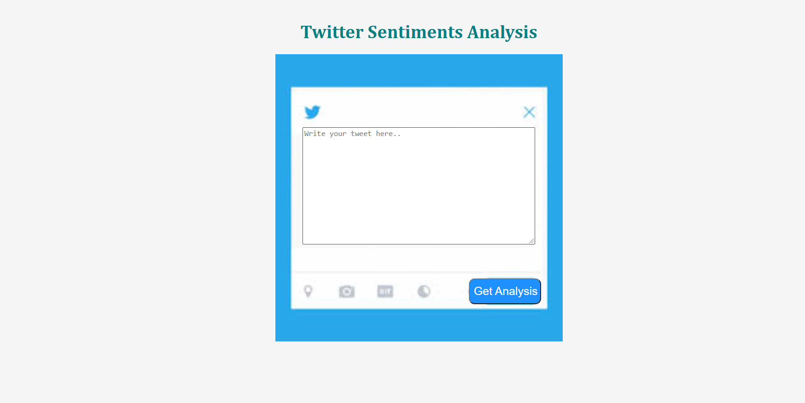
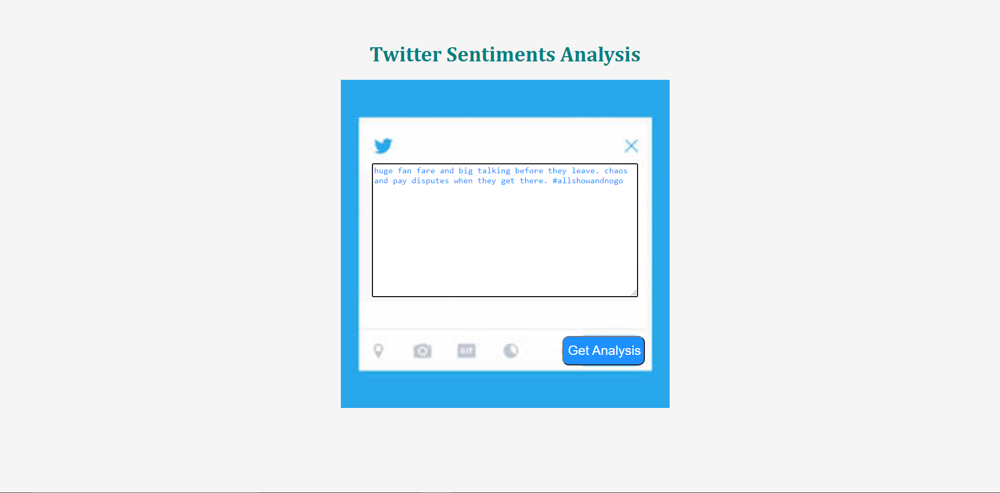
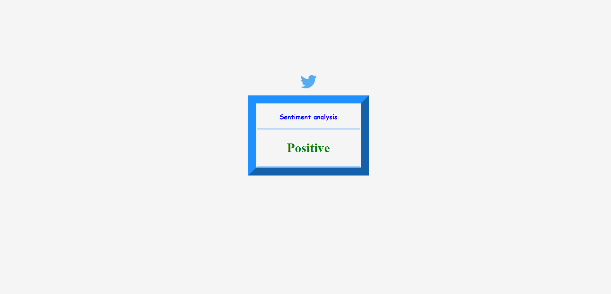

# twitter_sentiment_analysis

 

This repository consists of files required for end to end implementation and deployment of Machine Learning Twitter Sentiments Analysis web application created with flask and deployed on the Heroku platform.

# A glimpse of the web app:
- Home

- Home page

- Predict page

